# Bài 1 phần 2

## 1. Cấu hình NIC Teaming trên Windows Server 2012

### Bước làm của phần 2 này mình làm theo giáo trình để nhỡ may thầy có hỏi các bạn sẽ biết làm nhé

- **Sẽ có một bảng _ip_ để _cấu hình_ như này:**

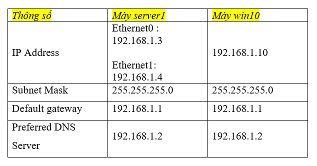

- **Các bạn sẽ vào phần _settings_ của máy _server_:**

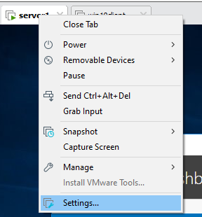

- **Các bạn sẽ ấn vào _ADD_, chọn _network adapter_ và nhấn _finish_:**

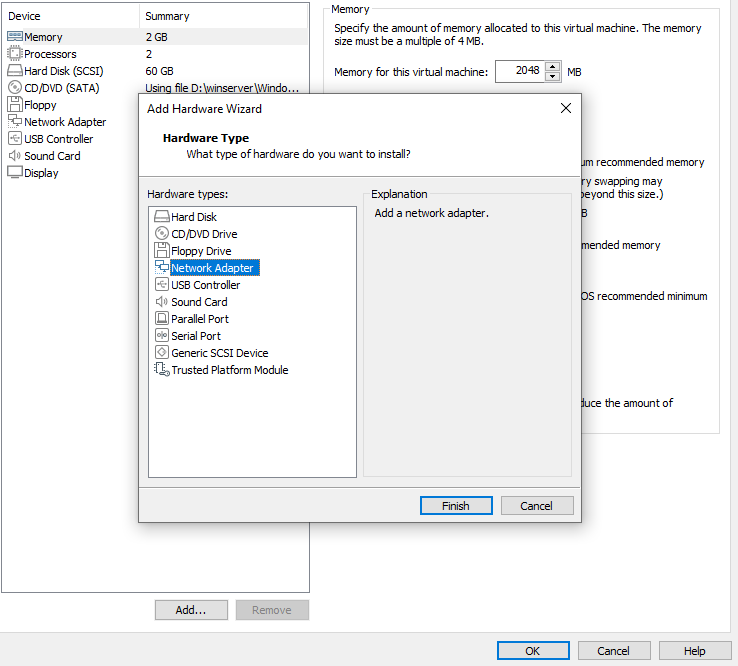

- **Tại cái _card mạng_ vừa thêm, các bạn ấn vào nó chọn _custom_ và để _VMnet_ mặc định giống nhau hết nhé, của mình để là _Vmnet0_:**

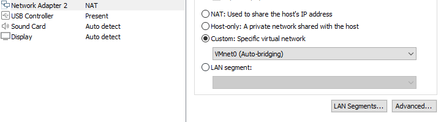

### Sau khi đã thêm 1 card mạng rồi, bạn sẽ đi cấu hình lại cả hai card mạng sao cho giống bảng ip mình đã gửi trên nhé

- **_Ethernet 0_ ở _winserver_ khi cấu hình sẽ như này:**

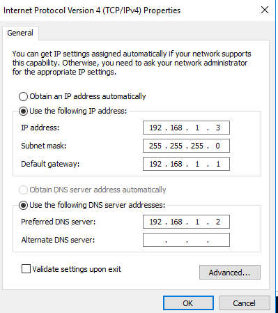

- **_Ethernet 1_ ở _winserver_ khi cấu hình sẽ như này:**

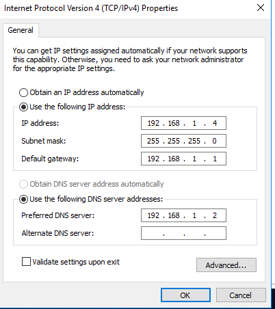

- **_Ethernet 0_ ở _win 10_:**

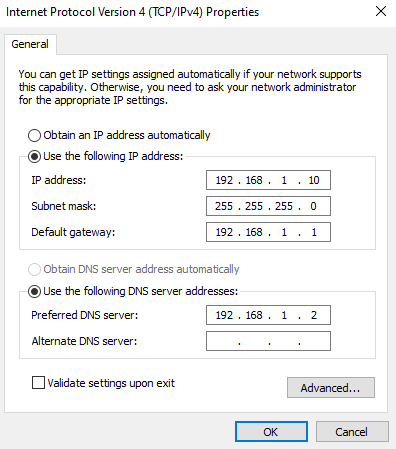

- **Sau khi đã cấu hình xong, bạn sẽ đứng ở máy _win 10_, bạn _ping_ đến hai ip của _Ethernet 0_ và _Ethernet 1_ của _winserver_ xem có ping được không nhé:**

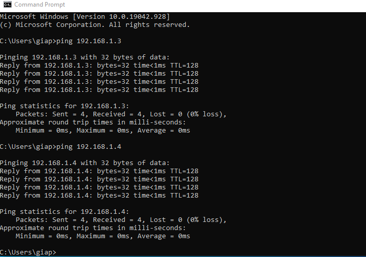

- **Sau khi đã ping thành công, bạn chuyển sang máy _server_ vào phần _server manager_, chọn vào _all server_, sau đó _click chuột phải_ vào như ảnh chọn _config NIC teaming_:**

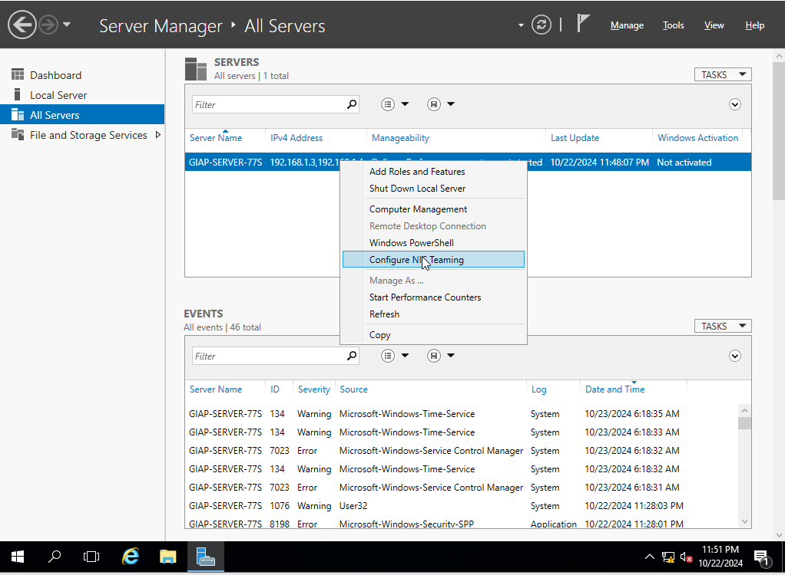

- **Sau đó bạn _click chuột phải_ vào 1 trong hai card mạng chọn _add new to team_:**

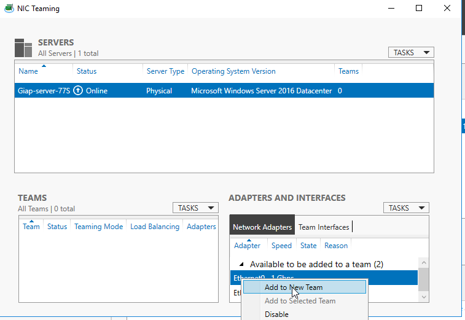

- **Bạn chọn nốt _card còn lại_ và _đặt tên_ cho nó:**

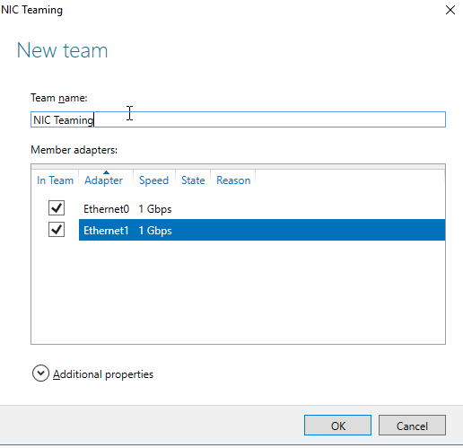

- **Nếu nó _hiển thị lỗi_ như này:**

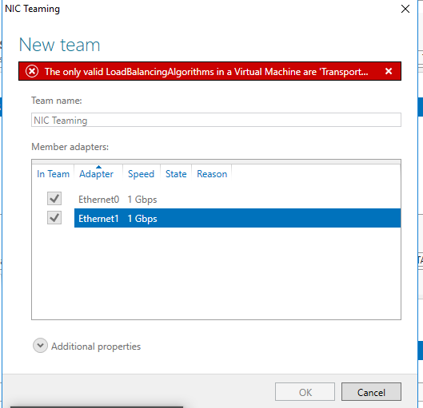

- **Các bạn sẽ _fix_ như sau: Các bạn sẽ ấn vào _additional properties_ và chọn như ảnh. Sau đó nhấn _ok_ đợi nó tạo:**

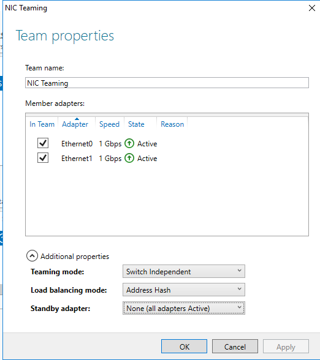

- **Nếu nó báo _màu vàng_ ở 1 trong hai cái card mạng, các bạn nhấn _refresh_ ở đây là được nhé:**

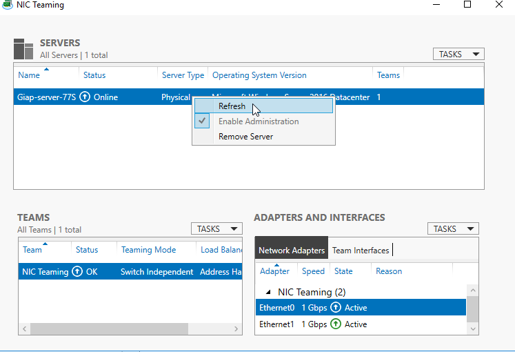

- **Sau đó bạn vào phần _network change adapter_, nó có phần này:**

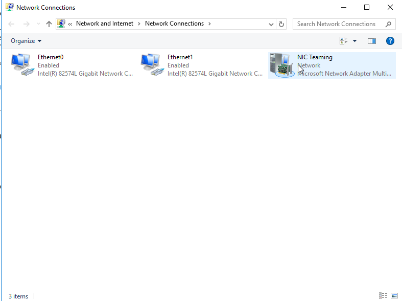

- **Sau đó bạn _cấu hình ip_ cho nó như này:**

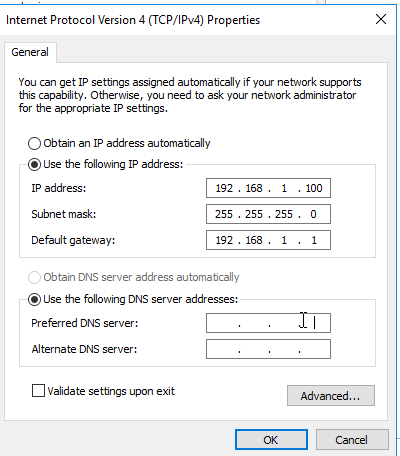

- **Rồi sau đó đứng bên máy _win 10_ bạn _ping_ đến cái _địa chỉ_ của nó:**

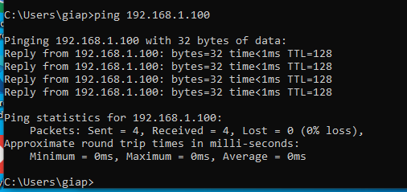
