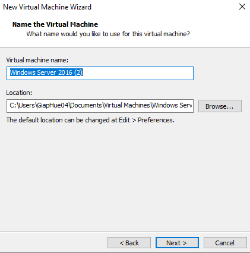
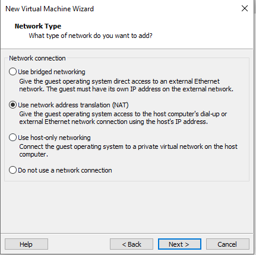
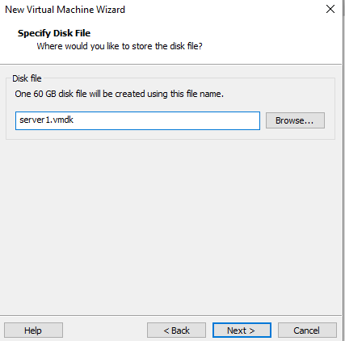
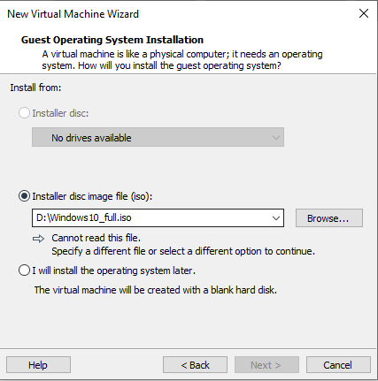
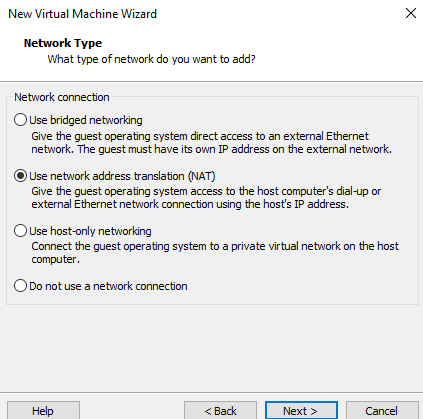
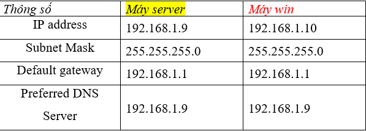

# Hướng dẫn cài đặt và thực hành với Windows Server

Xin chào tất cả các bạn! Trong repo này, mình sẽ hướng dẫn các bạn cài đặt Windows Server và thực hành với nó.

## Bài 1: Cài đặt Windows Server 2016 và Windows 10, làm quen với cách ping qua lại giữa 2 máy

Trong chương này, các bạn sẽ làm quen với:
- Cách cài đặt Windows
- Một số thao tác cấu hình cơ bản

### Yêu cầu:
- Có 1 máy ảo
- Có file ISO của Windows Server và Windows 10 (mình sẽ upload file vào repo này cho các bạn download nhé)

### Hướng dẫn cài đặt Windows Server và Windows 10

#### Bước 1: Mở VMware
Sau khi cài đặt VMware xong, các bạn mở lên. Giao diện sẽ như thế này:

1. Ấn chọn vào **Create a New Virtual Machine** để tạo ra một máy ảo mới để cài Windows Server.
2. Hiển thị ra mục này, các bạn chọn **Custom** và ấn **Next**.
   
3. Tiếp tục chọn **Next**.
   
4. Ở bước này, hãy chọn **Installer disc image file (iso)**. Bạn cần tải trước hai file ISO của Windows Server và Windows 10 để chọn vào nhé. Lưu chúng vào chỗ dễ nhớ.
   - Mình sẽ cài Windows Server trước. Tiếp theo, chọn file ISO của Windows Server (ở đây mình đã cài từ trước nên nó hiện sẵn), rồi ấn **Next**.
   
5. Ở mục này, hãy nhập mật khẩu: `123456a@` cho tất cả các máy, ô bên dưới là xác nhận lại mật khẩu. Điền lại mật khẩu phía trên là xong nhé.
   
6. Nhấn **Yes** khi có thông báo.
   
7. Ở đây có hai ô cần điền:
   - Ô đầu là điền tên máy.
   - Ô có chữ **Location** là vị trí lưu trữ máy ảo. Chọn vào ô bên dưới để lưu vào ổ có nhiều dung lượng (ấn vào **Browse** để chọn ổ).
   
8. Tích chọn **BIOS**. Sau đó ấn **Next**.
   
9. Nếu máy bạn khỏe thì chọn cao lên, còn không cứ để mặc định nhé. Rồi ấn **Next** tiếp.
   
10. Để mặc định rồi ấn **Next**.
    
11. Tiếp tục để mặc định rồi ấn **Next**.
    
12. Nhấn **Next**.
    
13. Chọn **SCSI** và nhấn **Next**.
    
14. Để mặc định và ấn **Next**.
    
15. Chọn ô tròn ở giữa và nhấn **Next**.
    
16. Để mặc định rồi nhấn **Next**.
    
17. Nhấn **Finish**.
    
18. Ngồi đợi máy cài (bạn nào bị lỗi là do thiếu dung lượng hoặc máy yếu).
    
19. Sau khi cài xong máy, nếu xuất hiện thông báo này thì x bỏ hết đi là xong nhé.
    
20. Phần quản trị sẽ hiện ra như này.
    

## Phần 2: Cài máy Windows 10

Tiếp theo, ấn vào mục **Home** và chọn **Create a New Virtual Machine**.

Các bước tương tự như cài Windows Server nhé. Đến bước này, các bạn chọn file ISO Windows 10 đã tải trước đó.

Bước này cũng là đặt tên và chọn vị trí lưu (lưu ý là phải lưu vào chỗ đặt cùng file ISO để tránh lỗi).

Chọn tiếp **BIOS** rồi nhấn **Next**.

Nếu máy khỏe, chọn cao lên cho mượt rồi ấn **Next**.

Tiếp theo, ấn **Next**.

Để mặc định rồi ấn **Next**.

Nhấn **Next** liên tục.

Chọn **SCSI** rồi nhấn **Next**.

Tiếp tục nhấn **Next**.

Chọn ô tròn ở giữa và nhấn **Next**.

Bước này hãy lưu lại cùng 1 chỗ với file ISO.

Nhấn **Finish** và đợi nó cài.

Khi đến bước này, nhấn **Next**.

Nhấn **Install Now**.

Chọn **Full Software** rồi nhấn **Next**.

Tích vào ô **Accept** rồi nhấn **Next**.

Chọn ô **Custom**.

Nó sẽ hiển thị ra như này. Sau đó nhấn vào **New** chỗ mũi tên mình chỉ.

Ấn **Apply**.

Nhấn **OK**.

Chọn như trong hình rồi nhấn **Next**. Đợi nó cài.

Khi đến bước này, nhấn **Yes**.

Bước này cũng chọn cái đầu và **Yes**. Nên để bàn phím tiếng Anh nhé.

Tiếp theo, chọn **Skip**.

Đến bước này, chọn **I don’t have internet connection** để tránh việc đăng nhập mất thời gian.

Chọn ô bên trái để tránh setup nhiều.

Sau đó, đặt tên cho máy của mình, rồi **Next**.

Đặt mật khẩu máy (nhớ là mật khẩu mọi máy đều là `123456a@`).

Xác nhận lại password.

Ở bước này, nó hỏi câu hỏi bảo mật, các bạn cứ chọn 3 câu tùy ý rồi điền là được, không quan trọng.

Và cả hai Windows Server và Windows 10 đã cài xong nhé!

## Phần 3: Hướng dẫn ping qua lại giữa 2 máy

Đây là bảng IP để kiểm tra. Thầy cho IP, các bạn cũng làm tương tự.

### Cấu hình máy Server

1. Vào máy Server trước.
2. Vào **Control Panel** > **Network and Internet**.
   
3. Chọn **Network and Sharing Center**.
   
4. Chọn **Ethernet0** > **Properties**.
5. Bỏ chọn **TCP/IPv6**.
6. Click đúp vào **TCP/IPv4**.
   
7. Chọn **Use the following IP address** và điền thông tin như hình:
   
8. Nhấn **OK** để hoàn tất.
   

### Cấu hình máy Windows 10

1. Vào máy Windows 10 và làm tương tự như máy Server.
2. Vào **Control Panel** > **Network and Internet**.
3. Chọn **Network and Sharing Center**.
4. Chọn **Ethernet0** > **Properties**.
5. Bỏ chọn **TCP/IPv6** và click đúp vào **TCP/IPv4**.
6. Nhập địa chỉ IP tương tự như máy Server và nhấn **OK**.

### Tắt Tường Lửa

1. Để có thể ping được, bạn cần tắt tường lửa cho cả 2 máy.
2. Vào **Control Panel** > **System and Security**.
   
3. Chọn **Windows Firewall** > **Turn Windows Firewall on or off**.
   
4. Tích chọn để tắt tường lửa cho cả 2 máy rồi ấn **OK**.

### Kiểm tra kết nối

1. Vào phần Settings của từng máy, kiểm tra cấu hình VMnet của Adapter.
2. Chọn **Custom** và đảm bảo cả 2 máy sử dụng cùng một VMnet.
3. Thực hiện ping từ máy Server đến máy Windows 10 bằng cách mở **cmd** lên và gõ lệnh ping theo địa chỉ IP của máy Windows 10:
   

### Lệnh kiểm tra cơ bản

- `hostname`: Xem tên máy.
- `ipconfig /all`: Xem thông tin IP của máy.
- `ping`: Kiểm tra kết nối internet.

Nếu cần đổi tên máy Server, làm như sau:
1. Vào **Settings** > **System** > **About** và đổi tên máy.
   

2. Khởi động lại máy để cập nhật tên.

---

Hy vọng hướng dẫn này giúp ích cho các bạn trong việc cài đặt và thực hành với Windows Server! Nếu có thắc mắc nào, đừng ngần ngại hỏi nhé!
