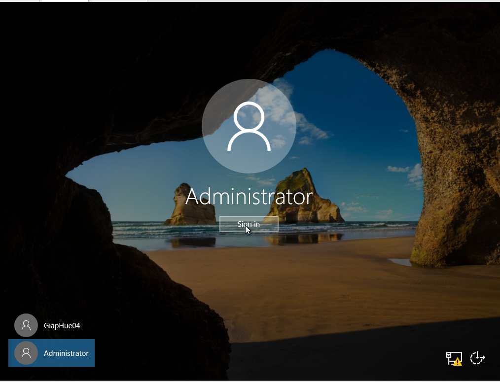

# 2.1. Nâng cấp máy chủ Windows Server 2012 lên Domain Controller và Join Domain
**Chú ý**: Trước khi làm bài này, tất cả card mạng của máy server1 của bài 1 các bạn xoá hết đi cho mình nhé rồi thêm lại card mạng như ở bài 1 đã học.
- xoá card NIC Teaming các bạn làm như sau:
  - Vào phần server manager vào all server nhân chuột phải như trong ảnh và nhấn vào config NIC Teaming.
  
- Click chuột phải vào chọn delete.
  
- Tiếp theo chọn phần setting của máy server
  
  - Xoá các card mạng của máy server , nhấn chữ "remove" và sau đó nhấn oke
  
- Thêm lại card mạng như ở bài 1 đã học. **_Chú ý_:**
  - Đảm bảo cả 2 máy sử dụng cùng một VMnet.
  - Của mình là VMnet0.
  

## Tiếp theo bạn cấu hình ip cho card mạng của máy server1 và card mạng của máy win10 như sau :
- Bảng ip của mình như sau :
  
- Cấu hình ip cho card mạng của máy server1 như sau :
  
- Cấu hình ip cho card mạng của máy win10 như sau :
  

**_Chú ý_:** Các bạn ping thử từ win10 đến ip server1 xem nó được chưa sẽ làm bước tiếp theo nhé.
### Thực hiện cài đặt dịch vụ Active Directory Domain Services trên máy server1
- Bạn vào máy server1 vào phần server manager nhẫn vào manage trên thanh công cụ.Chọn add roles and features.
  
- Bước này các bạn chọn NEXT
  
- Bước này cũng Next nhé
  
- Bước này cũng Next
  
- Bước này chọn Active Directory Domain Services
  
  - Cửa sổ Add Roles and Features Wizard hiện ra, chọn Add Features.
  
- Rồi nhấn Next nhé
  
  - Bước này nhấn Next tiếp nhé
  
  - Next tiếp
  
  - bước này tích chọn vào restart the destination server automatically is required .Rồi ấn install
  
  - KHI cài xong các bạn nhấn đóng là được
  
  - Để làm tiếp bước này các bạn cần đặt mật khẩu cho Administrator trên máy server1.Để tránh cài đặt bị lỗi nhé
  
  - Đặt mật khẩu cho Administrator .Đầu tiên các bạn nhấn Ctrl + Alt + Delete để vào màn hình login. Nó sẽ hiện ra máy chính trước các bạn chọn "Switch User" cứ nhập mật khẩu máy chính như bình thường rồi vào máy ảo cũng chọn "Switch User" nhé.
  
 - Sau đó các bạn nhấn Ctrl + Alt + insert để vào màn hình login.Và các bạn đổi sang User Administrator nhé.Rồi các bạn ấn sign in vào nhé.
  
- NÓ yêu cầu thay đổi mật khẩu bạn cứ nhấn oke nhé
  
- Các bạn nhập mật khẩu và xác nhận mật khẩu nhé như hình mình làm rồi nhấn nút mũi tên là được
  
- Nó hiện như này nhấn "ok"
  
  - Rồi các bạn nhấn sign in vào nhé
  
- Rồi nó sẽ vào màn hình như này trên thanh công cụ server manager nhấn vào biểu tượng của hình tam giác cảnh báo chọn promote this server to a domain controller
  
  - ở bước này các bạn tích chọn vào "Add a new forest" rồi đặt tên miền mới như trong hình theo yêu cầu của thầy nhé sau đó nhấn "Next"
  
  - ở bước này cac bạn nhập mật khẩu cho domain controller nhé. Mình để là 123456a@.Rồi nhấn "next"
  
  - Bước này cứ next nhé
  
  - Bước này cũng next nhé
  
  - Next tiếp
  
  - NExt tiếp
  
  - Đến Bước này như này mới là oke nhé xong các bạn nhấn install là được xong máy sẽ khởi động lại khi cài xong .
  
  **_Chú ý_:** Bạn nào bị lỗi mà không nhấn install được là chưa cài pass cho Administrator nhé. Mình có hướng dẫn cài ở trên rồi nhé
- Nhấn close để khởi động lại máy
  
- Các bạn đăng nhập lại vào máy với tài khoản Administrator và mật khẩu vừa tạo nhé.Nhẫn ctrl + alt + insert để vào màn hình login.
  
  - bạn kiểm tra xem nó đã có domain chưa bằng cách vào "Cài đặt" -> chọn " System" -> chọn "About" -> chọn"system infor"
  
  - chỗ mình đặt chuột là thành công rồi nhé
  
  - Rồi các bạn vào sửa lại card mạng như này nhé
  
### Join Domain
- Bạn vào máy win10 ping lại 1 lần nữa xem có được không nhé rồi mới thực hiện join domain nhé.
- Ping thành công các bạn join domain như sau :
  - Các bạn cũng vào setting chọn "System" -> chọn "About" -> chọn "Rename this Pc(advanced)"
  
  - Tiếp theo bạn nhấn "change"
  
  - Rồi các bạn tích vào ô Domain và nhập tên domain như trong hình rồi nhấn "ok"
  
  - NÓ yêu cầu nhập mật khẩu để join domain bạn làm như hình là được
  
  - HIển thị như này là được nhé nó nhẫn ok và đóng tất cả các cái vừa mở rồi nhấn restartnow là ok
  
