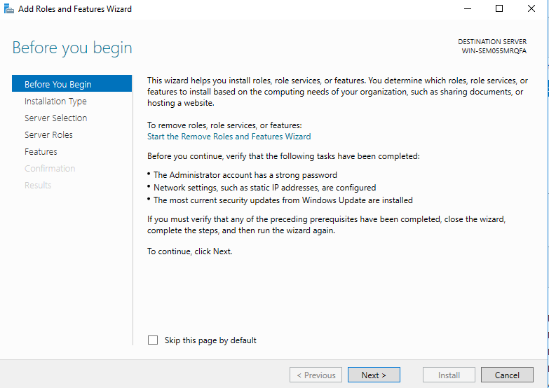

# 2.3 Cài đặt và cấu hình Additional Domain Controller

### Mục đích
Bài này nhằm cài đặt thêm một máy server để dự phòng. Khi máy chủ chính bị tấn công, bạn vẫn còn dữ liệu trên máy thứ hai.

## Các bước thực hiện

### Bước 1: Cài đặt máy server mới
**Cài đặt thêm một máy server mới theo hướng dẫn ở bài 1.**

### Bước 2: Cấu hình mạng
- Cấu hình máy chủ mới theo bảng sau và đặt về cùng vmnet0 với WinServer đã cài trước đó.
- **Tắt tường lửa** như đã làm trong các bài trước.

### Bước 3: Kiểm tra kết nối
**Thử ping để kiểm tra kết nối trước khi tiếp tục các bước tiếp theo.**

## Nâng cấp WinServer2 thành Domain Controller

1. Mở **Server Manager** và chọn **Add roles and features**.
2. Tại cửa sổ "Select server roles", chọn **Active Directory Domain Services**.
3. Tiếp tục nhấn Next qua các bước sau:

4. Tích chọn **Active Directory Domain Services** và add features như đã làm ở server1. Nhấn Next.

5. Tiếp tục nhấn Next qua các bước tiếp theo:

6. Nhấn **Install** để bắt đầu cài đặt.

7. Sau khi cài đặt hoàn tất, đóng cửa sổ.

**Lưu ý: Đặt mật khẩu cho administrator như đã làm ở server1.**

### Kích hoạt Domain Controller

1. Trong Server Manager, chọn **Promote this server to a domain controller**.

2. Chọn **Add a domain controller to an existing domain**. Nhập tên domain của bạn.

3. Nhấn "Change" và nhập thông tin đăng nhập. Mật khẩu là **123456a@**. Nhấn OK, sau đó Next.

4. Nhập lại mật khẩu **123456a@** và nhấn Next.

5. Tiếp tục nhấn Next qua các bước tiếp theo:

6. Nhấn **Install** để bắt đầu cài đặt.

7. Sau khi cài đặt hoàn tất, máy sẽ tự động khởi động lại.

8. Đăng nhập lại và kiểm tra như đã làm với server1.

## Tạo user mới và kiểm tra đồng bộ

1. Mở **Windows Administrative Tools**.

2. Chọn **Active Directory Users and Computers**.

3. Trong domain, tìm mục Users, nhấp chuột phải và chọn New > User.

4. Nhập thông tin user mới và nhấn Next.

5. Đặt mật khẩu cho user, bỏ tích các tùy chọn như hình và nhấn Next.

6. Nhấn Finish để hoàn tất.

7. Kiểm tra trên server1 để xác nhận user mới đã được đồng bộ.

