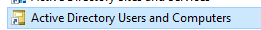

# BÀI 3. CẤU HÌNH CÁC ĐỐI TƯỢNG TRÊN ACTIVE DIRECTORY.
## YÊU CẦU
- ở bài này thì các bạn đã có sẵn máy server1 và máy khách đã join domain. như ở bài 2 rồi
- Bài này các bạn sẽ làm 2 lab nhỏ sau
    - Tạo và cấu hình tài khoản trên Domain Controller
    - Tạo OU , Group , User và cấu hình ủy quyền quản trị OU

### Lab 1. Tạo và cấu hình tài khoản trên Domain Controller
#### **Các bước tạo user**
- Các bạn vào máy server1 vào **Windows Administrative Tools** chọn **Active Directory Users and Computers**

- bấm vào **Active Directory Users and Computers**

- bấm chọn tên miền của các bạn

- bấm chọn **Users**

- nhấn chuột phải chọn **New** -> **User**

- Nhập thông tin user và nhấn **Next**
**Chú ý :**
- **First name** : là tên của user
- **Last name** : là họ của user
- **User logon name** : là tên đăng nhập của user

- Nhấn next và nhập password cho user
**Chú ý :** có các tuỳ chọn sau
- **User must change password at next logon** : tạo ngay mật khẩu khi đăng nhập lần đầu
- **User cannot change password** : user không thể thay đổi mật khẩu
- **Password never expires** : mật khẩu không hết hạn
- **Password expires** : mật khẩu hết hạn

- Nhấn **Next** và **Finish** là đã tạo xong user

- Bạn có thể set nhiều thuộc tính cho user bằng cách nhấn chuột phải vào user vừa tạo chọn **Properties** vào phần **Account**

#### **Các bước tạo group và thêm user vào group**
- Chuột phải rồi các bạn chọn **New** -> **Group** tương tự như user

- Các bạn nhập thông tin group  và nhấn **Next**, các thuộc tính các bạn để như ảnh
**Chú ý :**
- **Group scope** : phạm vi của group **Global**
- **Group type** : loại group để là **Security**

- Tạo xong group rồi các bạn thấy như hình và chọn **Properties** để tiến hành add user vào group

- Bấm vào **Members** chọn **Add** nó sẽ hiển thị ra cửa sổ **Select Users, Computers, or Groups**

- Tiếp theo chọn **Advanced** rồi cửa sổ hiển thị ra như hình các bạn chọn **Find Now** để tìm kiếm nhanh

- Ở đây các bạn nhấn Ctrl + chuột trái để chọn nhiều user và nhấn **OK** để thêm vào group

- Cửa sổ hiện ra nhấn **OK** là đã thêm xong

- Các bạn nhấn **Apply** và **OK** để xác nhận là hoàn tất

**Chú ý :**
 - Khi mà các bạn cấu hình các thuộc tính của user thì cấu hình xong các bạn đăng nhập để kiểm tra nhé xem có được chưa mình sẽ nêu các thuộc tính hay dùng
 - **Logon Hours** : giờ đăng nhập của user
 - **Account is disabled** : user bị vô hiệu hóa
 - **Account is locked out** : user bị khóa
 - **User cannot change password** : user không thể thay đổi mật khẩu
 - **User must change password at next logon** : tạo ngay mật khẩu khi đăng nhập lần đầu
 - **Password never expires** : mật khẩu không hết hạn
 - **Password expires** : mật khẩu hết hạn

### Lab 2. Tạo OU , Group , User và cấu hình ủy quyền quản trị OU
#### **Các bước tạo OU**
- Các bạn vào máy server1 vào **Windows Administrative Tools** chọn **Active Directory Users and Computers** như ở lab 1
-  Để tạo OU:
    - Click chuột phải tại tên miền bkaptech.vn, chọn **New** -> **Organizational Unit**

- Nhập tên và nhấn **OK** là đã tạo xong

- Để tạo OU Bên trong OU BAC Giang : thì ta chọn vào OU BAC Giang rồi click chuột phải chọn **New** -> **Organizational Unit**

 - Còn việc tạo User và Group thì các bạn làm tương tự như ở lab 1 nhé

#### **Các bước cấu hình ủy quyền quản trị OU**
 - các bạn chọn 1 OU bất kỳ rồi click chuột phải chọn **Delegate Control**

- Các bạn Nhấn **Next**

- Cac bạn nhấn **Add** để chọn user hoặc group có quyền quản trị OU

- Chọn **Advanced** để tìm kiếm nhanh user hoặc group

 - Các bạn chọn **Find Now** để tìm kiếm và chọn user hoặc group có quyền quản trị OU và nhấn **OK** nó hiện ra cửa sổ **Select Users, Computers, or Groups** nhấn **OK** là đã thêm xong

- Các bạn nhấn **Next**

- Chọn các quyền quản trị OU và nhấn **Next**

- Các bạn nhấn **Finish** là đã hoàn tất

- Tiếp theo các bạn vào máy khách đăng nhập tài khoản vừa cấu hình xem có được quyền quản trị OU và tháo tác các chức năng vừa chọn rồi sang máy server1 xem có cập nhật chưa nhé
