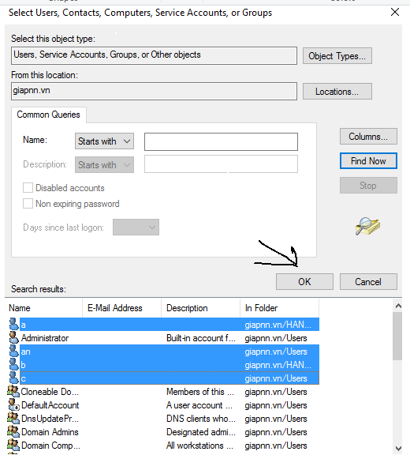
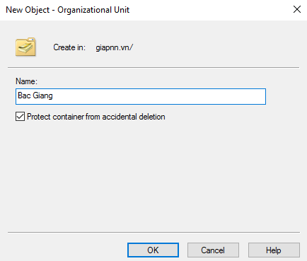

# BÀI 3: CẤU HÌNH CÁC ĐỐI TƯỢNG TRÊN ACTIVE DIRECTORY

## YÊU CẦU

- Trong bài này, bạn đã có sẵn máy `server1` và máy khách đã join domain như ở bài 2.
- Bài này bao gồm 2 lab nhỏ:
  - Tạo và cấu hình tài khoản trên Domain Controller.
  - Tạo OU, Group, User và cấu hình ủy quyền quản trị OU.

---

### Lab 1: Tạo và Cấu Hình Tài Khoản Trên Domain Controller

#### **Các Bước Tạo User**

1. Truy cập máy `server1`, vào **Windows Administrative Tools** và chọn **Active Directory Users and Computers**.

   

2. Chọn tên miền của bạn.

   

3. Chọn **Users**.

   

4. Nhấn chuột phải, chọn **New** -> **User**.

   

5. Nhập thông tin user và nhấn **Next**.

   **Chú ý:**
   - **First name**: Tên của user.
   - **Last name**: Họ của user.
   - **User logon name**: Tên đăng nhập của user.

   

6. Nhấn **Next** và nhập mật khẩu cho user.

   **Chú ý:**
   - **User must change password at next logon**: Tạo ngay mật khẩu khi đăng nhập lần đầu.
   - **User cannot change password**: User không thể thay đổi mật khẩu.
   - **Password never expires**: Mật khẩu không hết hạn.
   - **Password expires**: Mật khẩu hết hạn.

   

7. Nhấn **Next** và **Finish** để hoàn tất tạo user.

   

8. Để set nhiều thuộc tính cho user, nhấn chuột phải vào user vừa tạo, chọn **Properties** và vào phần **Account**.

   

#### **Các Bước Tạo Group và Thêm User Vào Group**

1. Nhấn chuột phải, chọn **New** -> **Group** tương tự như user.

   

2. Nhập thông tin group và nhấn **Next**. Các thuộc tính để như ảnh.

   **Chú ý:**
   - **Group scope**: Phạm vi của group **Global**.
   - **Group type**: Loại group để là **Security**.

   

3. Sau khi tạo xong group, chọn **Properties** để thêm user vào group.

   

4. Chọn **Members**, nhấn **Add** để mở cửa sổ **Select Users, Computers, or Groups**.

   

5. Chọn **Advanced**, sau đó chọn **Find Now** để tìm kiếm nhanh.

   

6. Nhấn Ctrl + chuột trái để chọn nhiều user và nhấn **OK** để thêm vào group.

   

7. Nhấn **OK** để hoàn tất.

   

8. Nhấn **Apply** và **OK** để xác nhận hoàn tất.

   

**Chú ý:**
- Khi cấu hình các thuộc tính của user, hãy đăng nhập để kiểm tra xem có được chưa. Các thuộc tính hay dùng:
  - **Logon Hours**: Giờ đăng nhập của user.
  - **Account is disabled**: User bị vô hiệu hóa.
  - **Account is locked out**: User bị khóa.
  - **User cannot change password**: User không thể thay đổi mật khẩu.
  - **User must change password at next logon**: Tạo ngay mật khẩu khi đăng nhập lần đầu.
  - **Password never expires**: Mật khẩu không hết hạn.
  - **Password expires**: Mật khẩu hết hạn.

   

---

### Lab 2: Tạo OU, Group, User và Cấu Hình Ủy Quyền Quản Trị OU

#### **Các Bước Tạo OU**

1. Truy cập máy `server1`, vào **Windows Administrative Tools** và chọn **Active Directory Users and Computers** như ở lab 1.

2. Để tạo OU:
   - Click chuột phải tại tên miền `bkaptech.vn`, chọn **New** -> **Organizational Unit**.

   

3. Nhập tên và nhấn **OK** để hoàn tất.

   

4. Để tạo OU bên trong OU BAC Giang, chọn vào OU BAC Giang, click chuột phải, chọn **New** -> **Organizational Unit**.

   

5. Việc tạo User và Group thực hiện tương tự như ở lab 1.

#### **Các Bước Cấu Hình Ủy Quyền Quản Trị OU**

1. Chọn một OU bất kỳ, click chuột phải, chọn **Delegate Control**.

   

2. Nhấn **Next**.

   

3. Nhấn **Add** để chọn user hoặc group có quyền quản trị OU.

   

4. Chọn **Advanced** để tìm kiếm nhanh user hoặc group.

   

5. Chọn **Find Now** để tìm kiếm và chọn user hoặc group có quyền quản trị OU, nhấn **OK** để mở cửa sổ **Select Users, Computers, or Groups**, nhấn **OK** để hoàn tất.

   

6. Nhấn **Next**.

   

7. Chọn các quyền quản trị OU và nhấn **Next**.

   

8. Nhấn **Finish** để hoàn tất.

   

9. Tiếp theo, vào máy khách, đăng nhập tài khoản vừa cấu hình để kiểm tra quyền quản trị OU và thực hiện các chức năng vừa chọn, sau đó quay lại máy `server1` để xem có cập nhật chưa.
